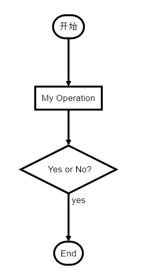

-------------------------------
# & 标题 
  ## 二级标题
  ### 三级
  #### 四级
  ##### 五级
  ###### 六级

 语法：  
  **[atx]形式**  
  \#1-6个对应h1-h6  
  只有一级标题带下划线，别的不带  
  ```
  #  标题   
  ## 二级标题  
  ### 三级  
  ```

  **[Setext]形式**  
  用=或者-分隔，=是一级标题，-是二级标题    
  ```
  一级标题
  ===
  二级标题
  ---
  ```

----------------------------------
# & 换行
  用**两个**或更多的空格就可以换行，会转换为\<br />

-------------------------------------
# & 块引用
> 引用内容
>> 嵌套引用

``` 
> 引用内容  
>> 嵌套引用
```

------------------------------------
# & 列表
### 无序列表
可用* + - ，生成出来无区别  
- 列表1
- 列表2
* 列表3
* 列表3
```
- 列表1
- 列表2
* 列表3
* 列表3
```

### 有序列表
数字+句号，数字序号对生成的html无区别  
1. 列表1
2. 列表2
3. 列表3  

```
1. 列表1
2. 列表2
3. 列表3  
```

**列表嵌套要用缩进**

-----------------------------
# & 分割线
三个或三个以上-或是*，效果一样
```
***
----
 ```

---------------------------------------
# & 字体
常规  
*斜体* _斜体_   
**加粗**   __粗体__  
***斜体加粗*** ___斜体加粗___   
~~我加了删除线哦~~

```
常规  
*斜体* _斜体_ 
**加粗**   __粗体__
***斜体加粗*** ___斜体加粗___   
~~我加了删除线哦~~
```

------------------------------------------
# & 图片
   
图片alt应出现在下方，可是这个没出来
```
  
```

-----------------------------------------
# & 超链接
## 行内式  
[百度](https://www.baidu.com "baidu")  
```
[超链接名字](超链接地址 "title")  
```  

## 参考式   
[知乎][a]

  [a]: http://www.zhihu.com "zhihu"  


```
[知乎][a]

  [a]: http://www.zhihu.com "zhihu"    
```
[超链接名字][id]  
空一行，然后下一行两个缩进  
  [链接标志]:链接地址 "title"  
  <br/>
问题：链接会在当前页面打开，不支持打开新页面 可以考虑\<a>标签实现

------------------------
# & 表格
表头|表头|表头
-|:-:|-:
文字居左|文字居中|居右对齐
内容|内容|内容

```
表头|表头|表头
-|:-:|-:
文字居左|文字居中|居右对齐
内容|内容|内容
```
第二行分割表头和内容  
-可以写多个，不要紧  
默认文字居左  
-两边加:表示文字居中  
-右边加:表示文字居右

# 十、代码
### 单行代码
用两个``包起来   

`return 0`   
```
`return 0` 
```

### 代码块
```  
function f(){
    console.log('代码块');
}  
```
\```  
function f(){  
    console.log('代码块');  
}    
\```

用\``` ```包起来


-------------------------
# & 流程图
待研究，但是github好像不支持此功能
```flow
st=>start: 开始
op=>operation: My Operation
cond=>condition: Yes or No?
e=>end
st->op->cond
cond(yes)->e
cond(no)->op
&
```

效果图  



